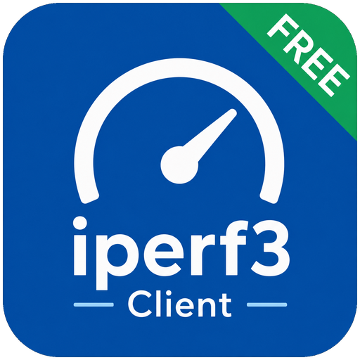

# Free iperf3 Client



[](https://ko-fi.com/Q5Q523WFO)

A deliberately free non-ad supported local only simple iperf3 client for Android phones, tablets, Android TV, and Google TV.
 - Basically I hate paying for free software, so here!

 Fair warning I did not program this, it is entirely vibecoded, if you do not like that, then do not use this free tested software that works and does what it is supposed to 😊

 I looked at available apps on Google Play Store and I got annoyed that free and open software was being packaged as GUI around a command and then they add ads/paid stuff.

 Free and open software is not there for exploitation, if you ask me.

[Download the latest APK](https://github.com/Anders0lesen/free-iperf3-client/releases/latest) · [Documentation](wiki/Home.md) · [Report a problem](https://github.com/Anders0lesen/free-iperf3-client/issues)

## Version 0.3.4

- Refactors the Compose interface into focused, reusable screen and component files without changing the local-only iperf3 engine.
- Reworks phone layouts for denser one-screen setup, clearer selection states, and a compact but readable start action.
- Reflows landscape, tablet, Android TV, and Google TV screens into purpose-built wide layouts for setup, live tests, results, failures, and QR export.
- Keeps live progress, charts, command visibility, D-pad focus, rotation survival, LAN discovery, recent servers, and privacy-safe result sharing from v0.3.1.

### Added in 0.3.1

- Keeps an active test, progress, selected server, and results intact when the device rotates.
- **Find iperf3 servers** scans the current local IPv4 network without requiring an address first, then accepts a result only after a real iperf3 exchange.
- Remembers up to eight successfully verified servers locally and lets you select, forget, or clear them.
- Fixes clipped bidirectional rates, units, interval text, and an unwanted Android 12+ system title bar.
- Uses purpose-built two-column TV layouts for configuration, live testing, charts, statistics, and interval details instead of stretching the phone layout.
- Shows a locally generated result QR on TV so the selected command and summary can be moved to a phone without copying text with a remote. No web server or QR service is used.
- Continues to support all v0.3.0 TCP, UDP, live-feedback, diagnostics, phone, and TV features.

### Added in 0.3.0

- Rebuilt as a dark-only, responsive interface for phones, tablets, Android TV, and Google TV.
- Uses crisp native line graphics based on the MIT-licensed Tabler icon style—no emoji controls.
- Adds live throughput charts, prominent results, min/average/max cards, expandable intervals, and clearer test-stage feedback.
- Makes server address, port, duration, and UDP target directly configurable.
- Checks that the endpoint is a responding iperf3 server before every test.
- Measures TCP download, upload, and simultaneous bidirectional throughput.
- Tests UDP streaming quality in both directions at a configurable target rate.
- Gives each UDP direction a clearly labelled 0–100 heuristic score based on delivered rate, packet loss, and jitter.
- **Run all tests** performs the complete sequence.
- Shows connection state, the exact command, overall progress, live rates, and per-second intervals while testing.
- Copies privacy-safe results or diagnostics by default; private endpoint and device details remain available only through the clearly labelled full-copy action.
- Opens this repository from the GitHub logo in the top-right corner.

The default UDP target is `50 Mbit/s`, which is a useful starting point for local game-streaming checks. Set it to the bitrate you actually want the network to sustain.

## No ads, tracking, or accounts

Official builds of this project will not contain ads. There is no advertising SDK, analytics, telemetry, account, login, or automatic crash upload.

The app requests only Android's network permissions: `INTERNET` and `ACCESS_NETWORK_STATE`. Neither produces a runtime permission prompt. It does not request storage, file, media, location, notification, microphone, camera, or background-service access. It stores no result history; up to eight successful server addresses and ports are kept in app-private preferences for the recent-server picker. See [PRIVACY.md](PRIVACY.md) and [SECURITY.md](SECURITY.md).

## Install

Download the APK from the [latest GitHub release](https://github.com/Anders0lesen/free-iperf3-client/releases/latest). The same APK supports Android 9 and newer on phones, tablets, Android TV, and Google TV.

Android will ask you to allow installation from the browser or file manager used to open the APK. These early GitHub releases use development signing. If Android reports that an update is incompatible, uninstall the older copy and install the new APK; this clears the local recent-server list, but there is no saved result history.

## Use

1. Start a reachable iperf3 server, for example `iperf3 -s`.
2. Press **Find iperf3 servers** to scan the current LAN, select a recent server, or enter an IP address/hostname manually. Leave port `5201` unless you changed it.
3. For UDP, enter the target rate you want to test in Mbit/s.
4. Choose one test or **Run all tests**.

Input errors are shown immediately. For valid input, the app first performs a small real iperf3 exchange. A throughput test starts only after that preflight succeeds.

Android/Google TV is remote-control navigable. Configuration rows use D-pad-friendly editor dialogs, every interactive control has a visible focus state, and wide screens arrange configuration/results into useful side-by-side panels. On a result, choose **Show result QR for phone** to scan the selected command and summary; the QR contains the entered server address but omits raw iperf output and is generated only on the device.

## Failure reports

Failures show a short reason, the failed stage, a retry action, technical details, and two explicit copy choices. The privacy-safe report redacts the endpoint and device model; the full local report includes versions, device architecture, test settings, raw iperf3 output, error, and stack trace. Nothing is uploaded automatically.

Repository documentation and release assets never include private test addresses or personal screenshots.

## Run an iperf3 server with Docker

The app needs a reachable [iperf3 server](https://github.com/esnet/iperf). This Compose file uses the [networkstatic/iperf3 image](https://hub.docker.com/r/networkstatic/iperf3):

```yaml
name: iperf3

services:
  iperf3:
    container_name: iperf3_server
    image: networkstatic/iperf3:latest
    command: ["-s"]
    ports:
      - "5201:5201/tcp"
      - "5201:5201/udp"
    restart: unless-stopped
```

Start it with `docker compose up -d`, then enter the Docker host's LAN, DNS, or Tailscale address. Both mappings are required for the app's TCP and UDP tests. Keep the server on a trusted LAN or private network rather than exposing it to the public internet. More detail is in [Docker iperf3 server](wiki/Docker-iperf3-server.md).

## Build

```powershell
.\gradlew.bat clean testDebugUnitTest lintDebug assembleDebug
```

The local APK is written to `app/build/outputs/apk/debug/app-debug.apk`. Pushes to `main` run the same build and publish the versioned GitHub release asset.

Implementation decisions, acceptance evidence, and the development history are kept in [docs/DEVELOPMENT.md](docs/DEVELOPMENT.md) and the versioned [project wiki](wiki/Home.md).

## Licensing

The application source is released under The Unlicense. It bundles iperf3 3.21 Android binaries built by [android-iperf3](https://github.com/davidBar-On/android-iperf3) from the BSD-3-Clause [ESnet iperf3 source](https://github.com/esnet/iperf). The line graphics are adapted from the MIT-licensed [Tabler Icons](https://tabler.io/icons) visual language. Local QR export uses Apache-2.0-licensed [ZXing Core](https://github.com/zxing/zxing). See [THIRD_PARTY_NOTICES.md](THIRD_PARTY_NOTICES.md).
